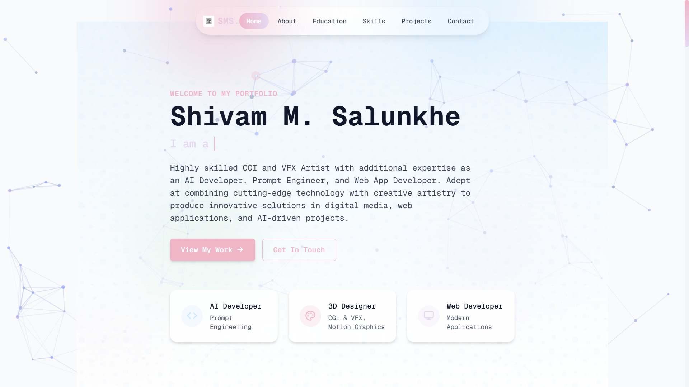

# My Portfolio & Resume

A personal portfolio and resume website for Shivam M. Salunkhe, showcasing 3D motion graphics design, CGI & VFX artistry, AI development, and web development projects.



<!-- Adjust width as needed (e.g., 500px) -->
<!--  -->


## Features

- Modern, responsive design with custom animations
- Interactive sections with smooth scroll navigation
- Particle background effect for enhanced visual appeal
- Custom cursor with interactive animations
- Projects showcase with detailed information
- Work experience timeline and education history
- Skills visualization with progress indicators
- Contact form with email integration
- Mobile and tablet responsive layouts
- "Back to top" button for easy navigation
- Custom UI components using shadcn/ui
- Intersection Observer API for scroll animations

## Technologies Used

- [React](https://react.dev/) – UI library
- [TypeScript](https://www.typescriptlang.org/) – Type-safe JavaScript
- [Tailwind CSS](https://tailwindcss.com/) – Utility-first CSS framework
- [Vite](https://vitejs.dev/) – Fast build tool and development server
- [Bun](https://bun.sh/) – JavaScript runtime and package manager
- [shadcn/ui](https://ui.shadcn.com/) – Accessible React components
- [Radix UI](https://www.radix-ui.com/) – Headless UI component primitives
- [lucide-react](https://lucide.dev/) – Beautiful & consistent icon set
- [react-intersection-observer](https://www.npmjs.com/package/react-intersection-observer) – Viewport detection for animations
- [react-tsparticles](https://particles.js.org/) – Particle background effects
- [React Router](https://reactrouter.com/) – Client-side routing
- [React Hook Form](https://react-hook-form.com/) – Form validation
- [Zod](https://zod.dev/) – TypeScript-first schema validation

## Project Structure

```
src/
  ├── components/              # React components
  │   ├── ui/                  # UI component library (shadcn/ui)
  │   ├── About.tsx            # About section with personal information
  │   ├── Contact.tsx          # Contact form and information
  │   ├── CustomCursor.tsx     # Interactive custom cursor component
  │   ├── Education.tsx        # Education and certifications section
  │   ├── Footer.tsx           # Page footer with links and credits
  │   ├── Hero.tsx             # Hero/landing section
  │   ├── Navbar.tsx           # Navigation component
  │   ├── ParticleBackground.tsx # Background particle animation
  │   ├── Projects.tsx         # Projects showcase section
  │   ├── ScrollToTop.tsx      # Button to scroll back to top
  │   └── Skills.tsx           # Skills and technologies section
  ├── hooks/                   # Custom React hooks
  │   ├── react-intersection-observer.tsx # Enhanced intersection observer
  │   ├── use-mobile.tsx       # Mobile device detection
  │   ├── use-toast.ts         # Toast notifications hook
  │   └── useScrollAnimation.tsx # Animation on scroll functionality
  ├── lib/                     # Utility functions
  │   └── utils.ts             # Common utility functions
  ├── pages/                   # Page components
  │   ├── Index.tsx            # Main landing page
  │   └── NotFound.tsx         # 404 page
  ├── App.tsx                  # Main application component
  ├── App.css                  # Global styles
  ├── index.css                # CSS entry point
  ├── main.tsx                 # Application entry point
  └── vite-env.d.ts           # Vite type definitions
```

## Getting Started

### Prerequisites

- Node.js (v18+) or Bun (latest)
- Git

### Installation

1. Clone the repository:
   ```bash
   git clone https://github.com/yourusername/My-Portfolio-Resume.git
   cd My-Portfolio-Resume
   ```

2. Install dependencies:
   ```bash
   # Using npm
   npm install
   # Or using Bun
   bun install
   ```

3. Start the development server:
   ```bash
   # Using npm
   npm run dev
   # Or using Bun
   bun run dev
   ```

4. Open your browser to `http://localhost:5173` to view the application.

### Building for Production

```bash
# Using npm
npm run build
# Or using Bun
bun run build
```

## Deployment

The project can be deployed to any static site hosting service, such as:
- [Vercel](https://vercel.com/)
- [Netlify](https://www.netlify.com/)

## Customization

- Update personal information in the respective component files
- Modify theme colors in `tailwind.config.ts`
- Add your projects in the `Projects.tsx` component
- Customize skills and education details in their respective components

## License

This project is open source and available under the [MIT License](LICENSE).
